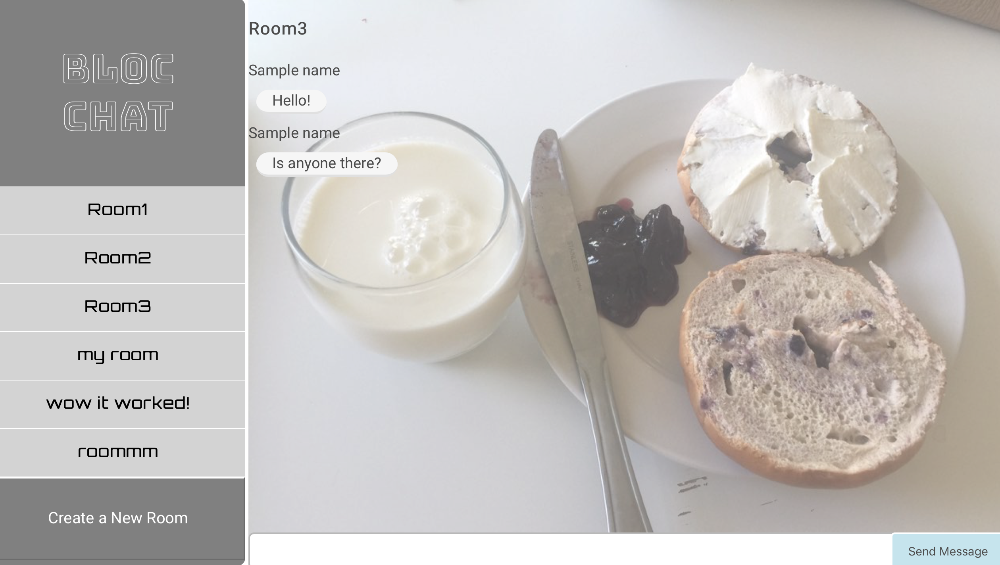

This app powers Bloc Chat at https://git.heroku.com/evening-falls-52182.git

## Bloc Chat

Bloc chat is a real-time chat application that uses Angular JS, Firebase, Bootstrap for UI, cookies used to store information in the user’s web browser.

## User Stories
- As a user, I want to see a list of available chat rooms
- As a user, I want to create chat rooms
- As a user, I want to see a list of messages in each chat room
- As a user, I want to set my username to display in chat rooms
- As a user, I want to send messages associated with my username in a chat room

## Configuration

The project uses Node to run a JS server in development. This will be important when we want to use urls /album or /collection instead of the basic album.html or collection.html. It may  help to review [our resource on NPM and `package.json` files](https://www.bloc.io/resources/npm-and-package-json).

Install the project dependencies by running:

```
$ npm install
```

## Run the Application

Run the application server:

```
$ npm start
```

The server will start up. To stop the server, press `cntrl + c`.

## License

Bloc Chat is released under the <LICENSE-NAME> license.

## Copyright

copyright:: (c) Copyright 2017 Bloc Chat. All Rights Reserved.
